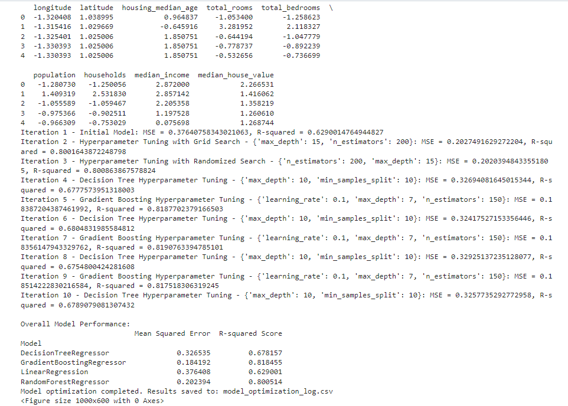

# Final_project
## Predicting Housing Prices in California
### Data Source: https://www.kaggle.com/datasets/shibumohapatra/house-price
Group Members: Suwaiba Idris, Shavez Hussain, Gwendoline Grenu, Arfan Hassan

### Aim 
* The project aims at building a model  housing tool that predicts median house values in California. chose to use a dataset (housing.csv), sourced from [Kaggle]("https://www.kaggle.com/datasets/shibumohapatra/house-price") for this purpose.
  
* We also aim to analyze the correlation between median household income and living space(no of total rooms).
  
* We also aim to analyze the correlation between median household income and house pricing.
  
* We also aim to analyze the correlation between median household income and median house price.

 **Data Exploration and Preprocessing:**
   - Using Python and pandas on jupyter notebook the dataset was explored and presented ready for further analysis.
   - Initial data analysis and visualization techniques are applied to gain insights into the features and target variable.
   - Preprocessing steps include handling missing values, outliers, dropping columnsas well as transforming variables as needed for model training.
   - One-hot encoding, was carried on 'ocean proximity' to modify the column to values that will enhance the predictive power of the model.

 **Model Development:**
   - Tested and evaluated different regression algorithms for their performance in predicting for our model.
  
   - Hyperparameter tuning (Grid Search and Random Search) was used to select the most effective model for the given dataset.
   - 
   - Performance metrics such as Mean Squared Error, R-squared, or others are computed to assess the model's accuracy.
  ### Model Optimization
  The overall performance of the model was tested in the following steps, 
- Used default Linear Regression model with no hyperparameter tuning.
-  Random Forest Regression models are used with Grid Search (2nd iteration) and Randomized Search (3rd iteration) for hyperparameter tuning, respectively.
- Subsequent iterations alternate between Decision Tree Regression and Gradient Boosting Regression models, each time using Grid Search for hyperparameter tuning.
Model Training and Evaluation:

The selected model is trained on the scaled training data, and its performance is evaluated on the scaled testing data using Mean Squared Error (MSE) and R-squared Score metrics.

The results of each iteration, including model name, tweaked parameters, changes made, MSE, and R-squared score, are logged to a CSV file (model_optimization_log.csv).
Lists (mse_values and r2_values) are used to store performance metrics for later visualization.

## Model Implementation
Using matplotlib and pandas a series of graphs were plotted to allow for visualisation of the data.
- A heatmap was plotted showing the correlation between showing between the columns with numeric values. Which shows a relatively good correlation.

To visualise the geographical distribution of the housing prices a scatter plot was plotted. This shows as we move closer to the ocean the housing price goes up.

The the true house values were then plotted against predicted house values for visualisation.

Above plot shows top 10 streets in California

Above is the interactive dashboard which changes according to input

The median house values for actual and predicted values, showing a close prediction.

The plot above displays the median housing price going up with median income value.

A geospatial map was created showing all the houses from our dataset and a hover information including the predicted housing prices.

### [Storytelly on Tableau](https://public.tableau.com/app/profile/gwendoline.grenu/viz/Project4-CaliforniaHousing/Story1#1)

